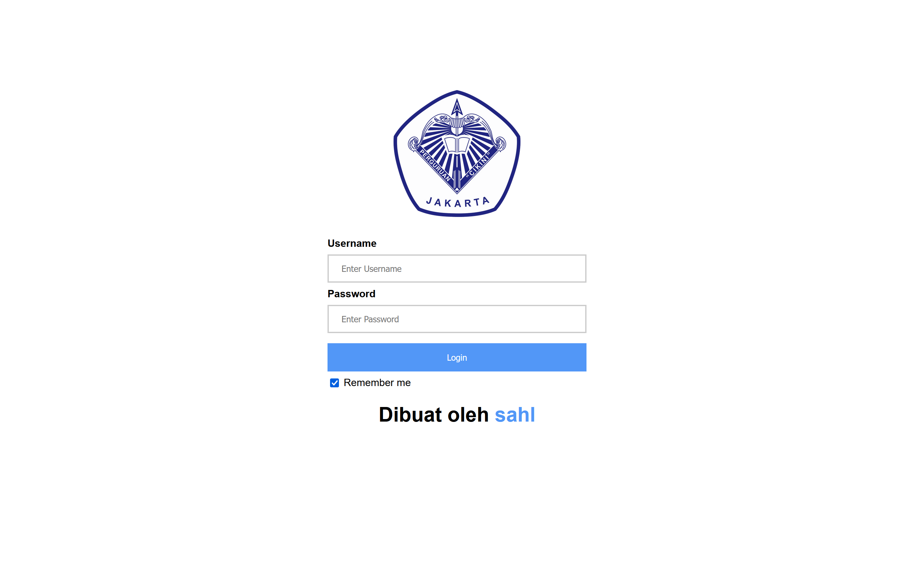
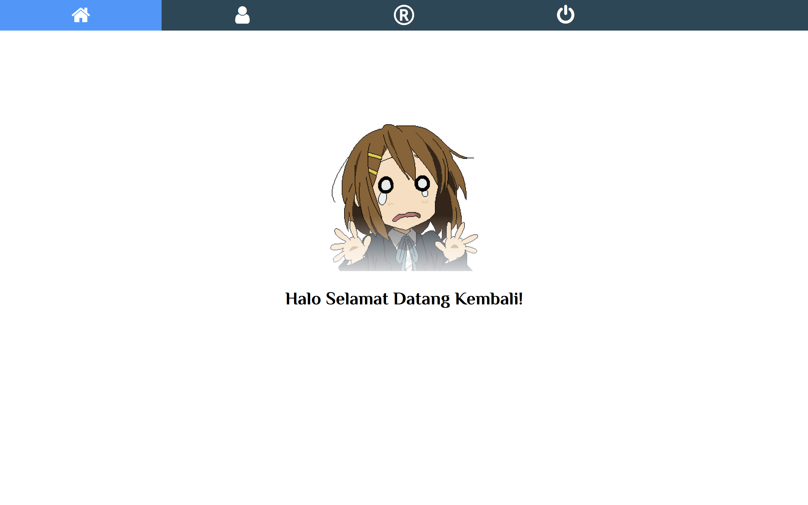

<!-- PROJECT LOGO -->
<br />
<div align="center">
    
  </a>

  <h3 align="center">Simple CRUD and Login system</h3>

  <p align="center">
    Database TASK
    <br />
  </p>
</div>


<!-- TABLE OF CONTENTS -->
<details>
  <summary>Table of Contents</summary>
  <ol>
    <li>
      <a href="#about-the-project">About The Project</a>
      <ul>
        <li><a href="#built-with">Built With</a></li>
      </ul>
    </li>
    <li>
      <a href="#getting-started">Getting Started</a>
      <ul>
        <li><a href="#prerequisites">Prerequisites</a></li>
        <li><a href="#installation">Installation</a></li>
      </ul>
    </li>
    <li><a href="#license">License</a></li>
    <li><a href="#contact">Contact</a></li>
  </ol>
</details>


<!-- ABOUT THE PROJECT -->
## About CRUD



Login page.



Home page.


### Built With

[]() (For Login & Authentication System)
</br>
[]() (DATABASES)
</br>


### Installation


Step 1: Download the Source Code

2. Clone the repo
   ```sh
   https://github.com/xanaqwert/Tugas-CRUD-LOGIN.git
   ```
3. Navigate to the project directory:
   ```sh
   cd Login
   ```
4. Make a database in your php my admin for the login & register authentication.


<!-- CONTRIBUTING -->
## Contributing

Contributions are what make the open source community such an amazing place to learn, inspire, and create. Any contributions you make are **greatly appreciated**.

If you have a suggestion that would make this better, please fork the repo and create a pull request. You can also simply open an issue with the tag "enhancement".
Don't forget to give the project a star! Thanks again!

1. Fork the Project
2. Create your Feature Branch (`git checkout -b feature/AmazingFeature`)
3. Commit your Changes (`git commit -m 'Add some AmazingFeature'`)
4. Push to the Branch (`git push origin feature/AmazingFeature`)
5. Open a Pull Request


<!-- CONTACT -->
## Contact

Muhammad Sahl Harits - [@xanaqwert](https://twitter.com/xanaqwert) - sahlrangers@gmail.com
</br>
